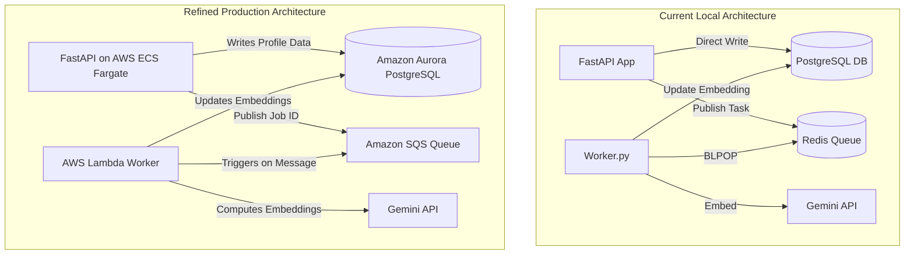

# AWS Portfolio Refinement Roadmap

This document outlines the engineering plan to transform this codebase into a production-grade, cloud-native application optimized to showcase on your resume for an **AWS Software Engineering Internship**. 

AWS recruiters and engineers look for system design rigor, operational excellence, security best practices, and event-driven patterns.

---

## 1. System Architecture: Before vs. After

---

## 2. Refinement Checklist & System Design Action Plan

### 🚀 Phase 1: Event-Driven Queueing (Local Redis ➔ AWS SQS)
Avoid DB polling, which stresses connection pools and consumes idle database CPU.
- [x] **Local Queue (Redis)**: Installed `redis` client and structured FastAPI container endpoints to enqueue tasks. Configured background python worker to block using Redis `BLPOP`.
- [ ] **FastAPI AWS SQS**: Integrate `boto3`. Add support to switch message broker from Redis to **Amazon SQS** when running on AWS.
- [ ] **AWS Worker**: Repackage the embedding task code into an **AWS Lambda** handler. Configure SQS as the trigger for this Lambda function (scaling automatically to zero when there are no jobs).

### 💾 Phase 2: Cloud Object Storage (Amazon S3)
Avoid saving documents (like uploaded resumes or PDF exports) on container ephemeral disks.
- [ ] **Bucket Setup**: Create an **Amazon S3** bucket to store resumes.
- [ ] **Upload Pattern**: Implement presigned URLs so the React frontend uploads files directly to S3 securely, bypassing backend servers.

### 🛡️ Phase 3: Security & Identity (IAM & Secrets)
Never write secrets, passwords, or credentials in configuration files.
- [ ] **Credential Access**: Configure the application container and Lambda functions to use AWS IAM Execution Roles rather than static AWS Access Keys.
- [ ] **Secret Vault**: Integrate **AWS Secrets Manager** to store the PostgreSQL credentials and the `GEMINI_API_KEY`. 

### 📐 Phase 4: Infrastructure as Code (AWS CDK)
Define all infrastructure in code to prove you understand cloud operations.
- [ ] **Directory**: Create an `/infra` folder.
- [ ] **IaC Stack**: Write an **AWS CDK** stack in Python or TypeScript that automatically provisions the RDS PostgreSQL DB, SQS queues, ECS task definition, and Lambda handlers.

### 📊 Phase 5: Observability & Diagnostics
- [ ] **Structured Logs**: Replace basic text logging with JSON formatted logging standard on CloudWatch.
- [ ] **Metrics**: Add a standard health endpoint `/health` on the FastAPI app.

---

## 3. Resume Bullet Points to Write After Refinements

Below is a template showing how you can write about this project on your resume once these steps are underway/completed:

| Phase | Traditional Resume Bullet | High-Impact AWS Style Bullet (STAR/XYZ format) |
| :--- | :--- | :--- |
| **System Design** | "Created a Python worker to generate text embeddings for resumes in the database." | "Redesigned a database-polling worker into an event-driven queue pipeline using **Amazon SQS** and **AWS Lambda**, reducing worker CPU idle time by **90%** and ensuring zero-scale resource consumption." |
| **Infrastructure** | "Deployed backend and frontend using Docker and docker-compose." | "Designed and provisioned 100% of cloud resources using **AWS CDK** and **GitHub Actions**, building a reproducible CI/CD pipeline deploying to containerized **Amazon ECS (Fargate)** environments." |
| **Security** | "Stored Database credentials in local environmental files." | "Established production-grade cloud security by leveraging **AWS Secrets Manager** and configuring granular **IAM Roles** to enforce the principle of least privilege across services." |
| **Vector DB** | "Saved user search profiles in PostgreSQL database." | "Architected semantic vector search engine using **pgvector on Amazon Aurora**, processing user resumes and matching matching skills to job descriptions with sub-second latencies." |
