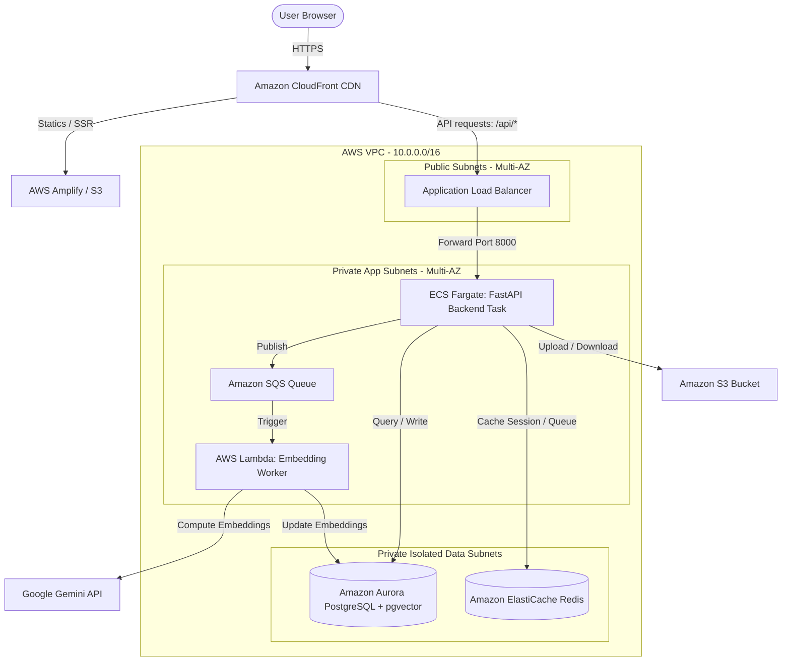

# AWS Production Deployment Architecture

This directory contains the documentation and diagrams detailing the cloud deployment topology of the **AI Resume Generator and Application Tracker** on AWS.

---

## 1. Physical Deployment Topology

Below is the infrastructure diagram showing how the frontend, backend, database, and background workers are distributed across AWS Availability Zones (AZs) inside a secure Virtual Private Cloud (VPC).

---

## 2. Component Directory

| Component | AWS Resource | Deployment Strategy |
| :--- | :--- | :--- |
| **Frontend UI** | AWS Amplify or S3 + CloudFront | Fully managed Static/SSR Next.js hosting with global CDN delivery. |
| **API Backend** | AWS ECS Fargate | Containerized FastAPI instances autoscaling based on HTTP request load within private subnets. |
| **Broker / Cache** | Amazon ElastiCache (Redis) | Managed Redis cluster for quick caching, session storage, and rate limiting. |
| **Message Queue** | Amazon SQS | Serverless queue coordinating worker processing asynchronously. |
| **Background Worker** | AWS Lambda | Serverless execution framework triggering on SQS events to run Gemini embedding tasks. |
| **Database** | Amazon Aurora PostgreSQL (Serverless v2) | High availability database running the `pgvector` extension for semantic searches. |
| **Secrets Engine** | AWS Secrets Manager | Secure environment variable storage (Gemini API keys, DB credentials). |

---

## 3. Security Guidelines & Multi-AZ Strategy

1. **VPC Isolation**:
   * All application servers (ECS) and databases run inside private and isolated subnets.
   * No direct internet access is allowed. Public ingress is mediated exclusively by the Application Load Balancer (ALB) and CloudFront.
2. **Access Control**:
   * Security Groups allow traffic only on necessary ports (e.g. ALB can speak to ECS on `8000`, but RDS only accepts connections from ECS and Lambda security groups on `5432`).
   * Containers and Lambdas assume dedicated **IAM Execution Roles** mapping to policies that follow the principle of least privilege.
3. **Data Protection**:
   * S3 Buckets are private by default; assets are retrieved safely using short-lived S3 Presigned URLs.
   * Encryption is turned on at-rest for RDS, S3, and Secrets Manager.
